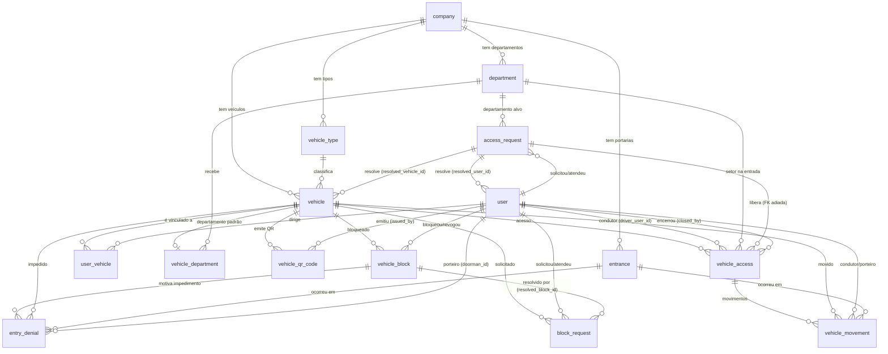

# Modelagem — Controle de veículos e fluxo de acesso

> Modelagem do banco para o **escopo de controle de veículos e fluxo de acesso** do SOMAR: catálogo de veículos, portarias, bloqueios, movimento/ocupação e solicitações de cadastro.
> Implementada pelas migrations `0002` a `0005` (ver `src/shared/database/typeorm/migrations/`), conforme [ADR 0001](../adr/0001-migrations-seeds-iniciais.md).
> Regras de negócio deste escopo: [regras-negocio-controle-veiculos.md](../produto/regras-negocio-controle-veiculos.md).

## Escopo

Tabelas do domínio de veículos e acesso:

| Domínio lógico           | Tabelas                                                                                          | Migração |
| ------------------------ | ------------------------------------------------------------------------------------------------ | -------- |
| Catálogo de veículos     | `vehicle_type`, `vehicle`, `department`, `vehicle_department`, `user_vehicle`, `vehicle_qr_code` | `0002`   |
| Portarias e bloqueios    | `entrance`, `vehicle_block`, `entry_denial`, `block_request`                                     | `0003`   |
| Movimento e ocupação     | `occupancy_snapshot`, `vehicle_access`, `vehicle_movement`                                       | `0004`   |
| Solicitações de cadastro | `access_request` (+ FK adiada de `vehicle_access.access_request_id`)                             | `0005`   |

Tabelas de **tenant, usuários e RBAC** (`company`, `user`, `role`, `permission`, `role_permission`, `user_role`) e de **suporte operacional** (`device`, `import_job`, `audit_log`) estão documentadas em [modelagem-usuarios-empresas-permissoes.md](./modelagem-usuarios-empresas-permissoes.md).

## Diagrama de entidades (visão geral)



> A tabela `user` é definida no escopo de [usuários/empresas/permissões](./modelagem-usuarios-empresas-permissoes.md); aqui aparece apenas como referência das FKs.

## Catálogo de veículos (migração `0002`)

### `vehicle_type` — tipos de veículo por empresa

Categorias definidas por cada empresa (ex.: `FROTA`, `PARTICULAR`) — não é enum fixo. `is_fleet` é apenas **classificação** (relatórios/frota em uso), não define ocupação: **todos os veículos ocupam vaga**.

| Coluna                      | Tipo                               | Constraints / Notas               |
| --------------------------- | ---------------------------------- | --------------------------------- |
| `id`                        | uuid                               | PK, default `gen_random_uuid()`   |
| `company_id`                | uuid NOT NULL                      | FK → `company(id)`                |
| `code`                      | varchar(50) NOT NULL               | `UQ_vehicle_type_company_id_code` |
| `name`                      | varchar(100) NOT NULL              |                                   |
| `description`               | text NULL                          |                                   |
| `is_fleet`                  | boolean NOT NULL DEFAULT false     | classificação "frota da empresa"  |
| `is_active`                 | boolean NOT NULL DEFAULT true      |                                   |
| `created_at` / `updated_at` | timestamptz NOT NULL DEFAULT now() |                                   |

### `vehicle` — veículos

| Coluna                      | Tipo                               | Constraints / Notas                                               |
| --------------------------- | ---------------------------------- | ----------------------------------------------------------------- |
| `id`                        | uuid                               | PK, default `gen_random_uuid()`                                   |
| `plate`                     | varchar(10) NOT NULL               | normalizada (sem hífen, maiúscula); `UQ_vehicle_company_id_plate` |
| `company_id`                | uuid NOT NULL                      | FK → `company(id)`                                                |
| `model`                     | varchar(100) NULL                  |                                                                   |
| `color`                     | varchar(50) NULL                   |                                                                   |
| `observation`               | text NULL                          |                                                                   |
| `is_blocked`                | boolean NOT NULL DEFAULT false     | **derivado**: true se existe `vehicle_block` ACTIVE               |
| `free_pass`                 | boolean NOT NULL DEFAULT false     | só alterado com permissão específica                              |
| `vehicle_type_id`           | uuid NOT NULL                      | FK → `vehicle_type(id)`                                           |
| `is_active`                 | boolean NOT NULL DEFAULT true      | desativado (ex.: vendido) deixa de operar                         |
| `created_at` / `updated_at` | timestamptz NOT NULL DEFAULT now() |                                                                   |

Índices: `IDX_vehicle_company_id_vehicle_type_id (company_id, vehicle_type_id)`.

### `department` — departamentos e vagas

| Coluna                      | Tipo                               | Constraints / Notas                                           |
| --------------------------- | ---------------------------------- | ------------------------------------------------------------- |
| `id`                        | uuid                               | PK, default `gen_random_uuid()`                               |
| `name`                      | varchar(100) NOT NULL              |                                                               |
| `company_id`                | uuid NOT NULL                      | FK → `company(id)`                                            |
| `description`               | text NULL                          |                                                               |
| `parking_space`             | integer NOT NULL DEFAULT 0         | quantidade de vagas (cadastro obrigatório pela administração) |
| `is_active`                 | boolean NOT NULL DEFAULT true      |                                                               |
| `created_at` / `updated_at` | timestamptz NOT NULL DEFAULT now() |                                                               |

> **Não é seedado** — departamentos e a quantidade de vagas são cadastro da administração (decisão de negócio).

### `vehicle_department` — vínculo permanente: departamento padrão do veículo

| Coluna                      | Tipo                               | Constraints / Notas             |
| --------------------------- | ---------------------------------- | ------------------------------- |
| `id`                        | uuid                               | PK, default `gen_random_uuid()` |
| `company_id`                | uuid NOT NULL                      | FK → `company(id)`              |
| `vehicle_id`                | uuid NOT NULL                      | FK → `vehicle(id)`              |
| `department_id`             | uuid NOT NULL                      | FK → `department(id)`           |
| `is_active`                 | boolean NOT NULL DEFAULT true      |                                 |
| `created_at` / `updated_at` | timestamptz NOT NULL DEFAULT now() |                                 |

Uniques: `UQ_vehicle_department_company_vehicle UNIQUE (company_id, vehicle_id)` — **um departamento padrão por veículo**.

### `user_vehicle` — vínculo motorista ↔ veículo

| Coluna                      | Tipo                               | Constraints / Notas                      |
| --------------------------- | ---------------------------------- | ---------------------------------------- |
| `id`                        | uuid                               | PK, default `gen_random_uuid()`          |
| `company_id`                | uuid NOT NULL                      | FK → `company(id)`                       |
| `user_id`                   | uuid NOT NULL                      | FK → `user(id)`                          |
| `vehicle_id`                | uuid NOT NULL                      | FK → `vehicle(id)`                       |
| `is_primary`                | boolean NOT NULL DEFAULT false     | proprietário principal do veículo        |
| `can_drive`                 | boolean NOT NULL DEFAULT true      | autorizado a dirigir (porteiro verifica) |
| `created_at` / `updated_at` | timestamptz NOT NULL DEFAULT now() |                                          |

Uniques:

- `UQ_user_vehicle_company_user_vehicle UNIQUE (company_id, user_id, vehicle_id)` — evita vínculo duplicado.
- `UQ_user_vehicle_company_vehicle_primary_true` — **único parcial** `(company_id, vehicle_id) WHERE is_primary = true` — apenas 1 proprietário primário por veículo.

### `vehicle_qr_code` — QR codes emitidos por veículo

> A partir do [ADR 0009](../adr/0009-emissao-de-qr-code-para-veiculos.md) (21/08), a tabela ganha a **feature de emissão de QR** (dentro de `vehicles`, permissão `PRINT_QRCODE`): emitir/reimprimir/reemitir/revogar + resolução pelo `code` (`GET /qr-codes/:code`, `REGISTER_ENTRY`, 410 para QR revogado). **Sem migration nova** — o schema abaixo já atende.

| Coluna                      | Tipo                               | Constraints / Notas                                                        |
| --------------------------- | ---------------------------------- | -------------------------------------------------------------------------- |
| `id`                        | uuid                               | PK, default `gen_random_uuid()`                                            |
| `company_id`                | uuid NOT NULL                      | FK → `company(id)`                                                         |
| `vehicle_id`                | uuid NOT NULL                      | FK → `vehicle(id)` — vínculo obrigatório                                   |
| `code`                      | varchar(64) NOT NULL               | token **único por emissão** (ex.: uuid); `UQ_vehicle_qr_code_company_code` |
| `is_active`                 | boolean NOT NULL DEFAULT true      | QR revogado/reemitido = "expirado" (não resolve)                           |
| `issued_by`                 | uuid NULL                          | FK → `user(id)` — quem imprimiu (auditoria)                                |
| `printed_at`                | timestamptz NULL                   |                                                                            |
| `created_at` / `updated_at` | timestamptz NOT NULL DEFAULT now() |                                                                            |

Uniques:

- `UQ_vehicle_qr_code_company_code UNIQUE (company_id, code)`.
- `UQ_vehicle_qr_code_company_vehicle_active_true` — **único parcial** `(company_id, vehicle_id) WHERE is_active = true` — apenas 1 QR ativo por veículo. Reemitir gera **novo** `code` (adesivo novo).

## Portarias e bloqueios (migração `0003`)

### `entrance` — portarias

| Coluna                      | Tipo                               | Constraints / Notas             |
| --------------------------- | ---------------------------------- | ------------------------------- |
| `id`                        | uuid                               | PK, default `gen_random_uuid()` |
| `company_id`                | uuid NOT NULL                      | FK → `company(id)`              |
| `name`                      | varchar(100) NOT NULL              | ex.: "Portaria Principal"       |
| `is_active`                 | boolean NOT NULL DEFAULT true      |                                 |
| `created_at` / `updated_at` | timestamptz NOT NULL DEFAULT now() |                                 |

### `vehicle_block` — estado de bloqueio (portão de acesso)

> **Estado** (não evento): define se o veículo está ou não bloqueado. Gerenciado **somente pela administração** ou pelo **sistema** (bloqueio automático). Histórico de estados: a única mutação permitida é `status ACTIVE → REVOKED`.

| Coluna                      | Tipo                                             | Constraints / Notas                                      |
| --------------------------- | ------------------------------------------------ | -------------------------------------------------------- |
| `id`                        | uuid                                             | PK, default `gen_random_uuid()`                          |
| `company_id`                | uuid NOT NULL                                    | FK → `company(id)`                                       |
| `vehicle_id`                | uuid NULL                                        | FK → `vehicle(id)` — preenchido se cadastrado            |
| `plate`                     | varchar(10) NOT NULL                             | normalizada; permite bloquear veículo **não cadastrado** |
| `block_type`                | `vehicle_block_type` NOT NULL DEFAULT 'MANUAL'   | `MANUAL` = admin; `AUTOMATIC` = sistema                  |
| `reason`                    | text NOT NULL                                    | motivo (obrigatório, exibido ao porteiro)                |
| `status`                    | `vehicle_block_status` NOT NULL DEFAULT 'ACTIVE' | `ACTIVE` / `REVOKED`                                     |
| `blocked_by`                | uuid NULL                                        | FK → `user(id)` — null apenas quando `AUTOMATIC`         |
| `blocked_at`                | timestamptz NOT NULL DEFAULT now()               |                                                          |
| `revoked_by`                | uuid NULL                                        | FK → `user(id)` — null = revogação automática            |
| `revoked_at`                | timestamptz NULL                                 |                                                          |
| `revoked_reason`            | text NULL                                        | motivo do desbloqueio (obrigatório quando revogado)      |
| `created_at` / `updated_at` | timestamptz NOT NULL DEFAULT now()               |                                                          |

Uniques parciais:

- `UQ_vehicle_block_company_vehicle_active` — `(company_id, vehicle_id) WHERE status = 'ACTIVE' AND vehicle_id IS NOT NULL` — 1 bloqueio ativo por veículo cadastrado.
- `UQ_vehicle_block_company_plate_active_unreg` — `(company_id, plate) WHERE status = 'ACTIVE' AND vehicle_id IS NULL` — 1 bloqueio ativo por placa de veículo não cadastrado.

> Regra: bloqueio por placa + veículo cadastrado depois → **vincula pela placa** (preenche `vehicle_id`), não revoga.

### `entry_denial` — evento de impedimento (ledger, append-only)

> **Evento**: porteiro impediu a entrada. Ledger imutável — nunca é deletado.

| Coluna                      | Tipo                                     | Constraints / Notas                                                |
| --------------------------- | ---------------------------------------- | ------------------------------------------------------------------ |
| `id`                        | uuid                                     | PK, default `gen_random_uuid()`                                    |
| `company_id`                | uuid NOT NULL                            | FK → `company(id)`                                                 |
| `vehicle_id`                | uuid NULL                                | FK → `vehicle(id)` — preenchido se cadastrado                      |
| `plate_snapshot`            | varchar(10) NOT NULL                     | placa lida no momento                                              |
| `block_id`                  | uuid NULL                                | FK → `vehicle_block(id)` — bloqueio que motivou, se houver         |
| `reason`                    | `entry_denial_reason` NOT NULL           | `BLOCKED`, `UNREGISTERED`, `UNAUTHORIZED_DRIVER`, `OTHER`          |
| `observation`               | text NULL                                | observação livre do porteiro                                       |
| `entrance_id`               | uuid NULL                                | FK → `entrance(id)` — preenchida do device quando vinculado        |
| `doorman_id`                | uuid NOT NULL                            | FK → `user(id)` — porteiro que impediu                             |
| `occurred_at`               | timestamptz NOT NULL DEFAULT now()       | momento real do evento                                             |
| `sync_status`               | `sync_status` NOT NULL DEFAULT 'PENDING' | resiliência offline do app (`PENDING`/`SYNCED`)                    |
| `idempotency_key`           | uuid NOT NULL                            | `UQ_entry_denial_company_idempotency_key` — evita duplicar no sync |
| `created_at` / `updated_at` | timestamptz NOT NULL DEFAULT now()       |                                                                    |

Índices: `IDX_entry_denial_company_occurred_at (company_id, occurred_at)`.

### `block_request` — solicitação de bloqueio pelo porteiro

> Porteiro **solicita**; administração **aprova ou rejeita**. O estado `vehicle_block` só é criado pela admin/sistema.

| Coluna                      | Tipo                                              | Constraints / Notas                                 |
| --------------------------- | ------------------------------------------------- | --------------------------------------------------- |
| `id`                        | uuid                                              | PK, default `gen_random_uuid()`                     |
| `company_id`                | uuid NOT NULL                                     | FK → `company(id)`                                  |
| `vehicle_id`                | uuid NULL                                         | FK → `vehicle(id)` — veículo cadastrado, se houver  |
| `plate`                     | varchar(10) NOT NULL                              | normalizada; permite veículo não cadastrado         |
| `reason`                    | text NOT NULL                                     | motivo (obrigatório)                                |
| `status`                    | `block_request_status` NOT NULL DEFAULT 'PENDING' | `PENDING`, `APPROVED`, `REJECTED`, `CANCELLED`      |
| `requested_by`              | uuid NOT NULL                                     | FK → `user(id)` — porteiro que solicitou            |
| `requested_at`              | timestamptz NOT NULL DEFAULT now()                |                                                     |
| `handled_by`                | uuid NULL                                         | FK → `user(id)` — admin que avaliou                 |
| `handled_at`                | timestamptz NULL                                  |                                                     |
| `observation`               | text NULL                                         |                                                     |
| `status_history`            | jsonb NOT NULL DEFAULT '[]'                       | timeline `[{status, at, by}]`                       |
| `resolved_block_id`         | uuid NULL                                         | FK → `vehicle_block(id)` — criado quando `APPROVED` |
| `sync_status`               | `sync_status` NOT NULL DEFAULT 'PENDING'          | resiliência offline do app                          |
| `idempotency_key`           | uuid NOT NULL                                     | `UQ_block_request_company_idempotency_key`          |
| `created_at` / `updated_at` | timestamptz NOT NULL DEFAULT now()                |                                                     |

Uniques parciais: `UQ_block_request_company_plate_pending (company_id, plate) WHERE status = 'PENDING'` — evita pedido duplicado da mesma placa em aberto.
Índices: `IDX_block_request_company_status (company_id, status)`.

## Movimento e ocupação (migração `0004`)

### `occupancy_snapshot` — otimização do dashboard de ocupação (job diário)

| Coluna                      | Tipo                               | Constraints / Notas                                                  |
| --------------------------- | ---------------------------------- | -------------------------------------------------------------------- |
| `id`                        | uuid                               | PK, default `gen_random_uuid()`                                      |
| `company_id`                | uuid NOT NULL                      | FK → `company(id)`                                                   |
| `date`                      | date NOT NULL                      | `UQ_occupancy_snapshot_company_date UNIQUE (company_id, date)`       |
| `slot_total`                | integer NOT NULL                   |                                                                      |
| `slot_occupied`             | integer NOT NULL                   |                                                                      |
| `occupancy_by_department`   | jsonb NOT NULL DEFAULT '[]'        | `[{department_id, count}]` — ids, não nomes (sobrevive a renomeação) |
| `peak_occupancy`            | integer NOT NULL DEFAULT 0         |                                                                      |
| `peak_at`                   | timestamptz NULL                   |                                                                      |
| `created_at` / `updated_at` | timestamptz NOT NULL DEFAULT now() |                                                                      |

> Captura do pico durante o dia: **a decidir** (job periódico).

### `vehicle_access` — estado da visita (acesso aberto/fechado)

> Estado corrente da visita de um veículo. `vehicle_access.access_request_id` é criada **sem FK** nesta migração; a FK é adicionada na `0005` (dependência circular resolvida por FK adiada — ver ADR 0001).

| Coluna                      | Tipo                                      | Constraints / Notas                                                                                 |
| --------------------------- | ----------------------------------------- | --------------------------------------------------------------------------------------------------- |
| `id`                        | uuid                                      | PK, default `gen_random_uuid()`                                                                     |
| `company_id`                | uuid NOT NULL                             | FK → `company(id)`                                                                                  |
| `vehicle_id`                | uuid NULL                                 | FK → `vehicle(id)` — NULL se não cadastrado (dados temporários); preenchido na resolução retroativa |
| `temporary_plate`           | varchar(10) NULL                          | placa de veículo não cadastrado                                                                     |
| `driver_user_id`            | uuid NULL                                 | FK → `user(id)` — condutor identificado                                                             |
| `temporary_driver_name`     | varchar(255) NULL                         | condutor não cadastrado                                                                             |
| `department_id`             | uuid NULL                                 | FK → `department(id)` — setor confirmado na entrada                                                 |
| `access_request_id`         | uuid NULL                                 | FK → `access_request(id)` (adicionada na `0005`)                                                    |
| `over_capacity`             | boolean NOT NULL DEFAULT false            | liberado mesmo com vaga cheia                                                                       |
| `status`                    | `access_status` NOT NULL DEFAULT 'INSIDE' | `INSIDE`, `OUT`, `NO_EXIT`, `MANUAL_CLOSED`                                                         |
| `forced_exit`               | boolean NOT NULL DEFAULT false            | saída forçada por reentrada                                                                         |
| `entry_at`                  | timestamptz NULL                          |                                                                                                     |
| `exit_at`                   | timestamptz NULL                          |                                                                                                     |
| `closed_by`                 | uuid NULL                                 | FK → `user(id)` — quem encerrou manualmente                                                         |
| `closed_at`                 | timestamptz NULL                          |                                                                                                     |
| `created_at` / `updated_at` | timestamptz NOT NULL DEFAULT now()        |                                                                                                     |

Índices:

- `IDX_vehicle_access_company_status (company_id, status)`
- `IDX_vehicle_access_company_vehicle_status (company_id, vehicle_id, status)`
- `IDX_vehicle_access_company_temporary_plate (company_id, temporary_plate)`

### `vehicle_movement` — ledger de eventos de entrada/saída (imutável)

> **Ledger**: cada evento de movimento é imutável (`type` nunca muda, `plate_snapshot` sobrevive a mudanças de cadastro).

| Coluna                      | Tipo                                     | Constraints / Notas                                   |
| --------------------------- | ---------------------------------------- | ----------------------------------------------------- |
| `id`                        | uuid                                     | PK, default `gen_random_uuid()`                       |
| `company_id`                | uuid NOT NULL                            | FK → `company(id)`                                    |
| `access_id`                 | uuid NULL                                | FK → `vehicle_access(id)` — vínculo com a visita      |
| `vehicle_id`                | uuid NULL                                | FK → `vehicle(id)` — NULL se ainda não cadastrado     |
| `type`                      | `movement_type` NOT NULL                 | `ENTRY` / `EXIT` — imutável                           |
| `occurred_at`               | timestamptz NOT NULL                     | momento real do evento (relógio app/servidor)         |
| `plate_snapshot`            | varchar(10) NOT NULL                     | placa lida no momento                                 |
| `driver_user_id`            | uuid NULL                                | FK → `user(id)` — condutor identificado no momento    |
| `department_id`             | uuid NULL                                | FK → `department(id)` — setor no momento do evento    |
| `source`                    | `movement_source` NOT NULL               | `APP`, `WEB`, `QRCODE`, `PLATE`, `INITIAL`, `MANUAL`  |
| `entrance_id`               | uuid NULL                                | FK → `entrance(id)` — portaria (preenchida do device) |
| `doorman_id`                | uuid NULL                                | FK → `user(id)` — quem registrou                      |
| `sync_status`               | `sync_status` NOT NULL DEFAULT 'PENDING' | resiliência offline do app                            |
| `idempotency_key`           | uuid NOT NULL                            | `UQ_vehicle_movement_company_idempotency_key`         |
| `created_at` / `updated_at` | timestamptz NOT NULL DEFAULT now()       |                                                       |

Índices:

- `IDX_vehicle_movement_company_occurred_at (company_id, occurred_at)`
- `IDX_vehicle_movement_company_plate_snapshot (company_id, plate_snapshot)`
- `IDX_vehicle_movement_company_vehicle_occurred_at (company_id, vehicle_id, occurred_at)`

## Solicitações de cadastro (migração `0005`)

### `access_request` — solicitação de cadastro e/ou vínculo

> Cenários `NEW_USER`, `NEW_VEHICLE`, `LINK`, `BOTH`. Criada pelo porteiro; aceite/rejeição exclusivos da administração.

| Coluna                      | Tipo                                               | Constraints / Notas                                                                           |
| --------------------------- | -------------------------------------------------- | --------------------------------------------------------------------------------------------- |
| `id`                        | uuid                                               | PK, default `gen_random_uuid()`                                                               |
| `company_id`                | uuid NOT NULL                                      | FK → `company(id)`                                                                            |
| `idempotency_key`           | uuid NOT NULL                                      | `UQ_access_request_company_idempotency_key`                                                   |
| `type`                      | `access_request_type` NOT NULL                     | `NEW_USER`, `NEW_VEHICLE`, `LINK`, `BOTH`                                                     |
| `plate`                     | varchar(10) NOT NULL                               | normalizada; coluna própria p/ busca e unique de duplicidade                                  |
| `vehicle_id`                | uuid NULL                                          | FK → `vehicle(id)` — existente (cenários `NEW_USER`, `LINK`)                                  |
| `user_id`                   | uuid NULL                                          | FK → `user(id)` — existente (cenários `NEW_VEHICLE`, `LINK`)                                  |
| `status`                    | `access_request_status` NOT NULL DEFAULT 'PENDING' | `PENDING`, `IN_CONTACT`, `REGISTERED`, `REJECTED`, `CANCELLED`                                |
| `entry_authorized`          | boolean NOT NULL DEFAULT false                     | porteiro decidiu liberar com dados temporários                                                |
| `authorized_by`             | uuid NULL                                          | FK → `user(id)`                                                                               |
| `authorized_at`             | timestamptz NULL                                   |                                                                                               |
| `requested_by`              | uuid NOT NULL                                      | FK → `user(id)` — porteiro que pediu                                                          |
| `requested_at`              | timestamptz NOT NULL DEFAULT now()                 |                                                                                               |
| `handled_by`                | uuid NULL                                          | FK → `user(id)` — admin que atendeu                                                           |
| `handled_at`                | timestamptz NULL                                   |                                                                                               |
| `contact_channel`           | `contact_channel` NULL                             | `WHATSAPP`, `PHONE`, `EMAIL`                                                                  |
| `contact_phone`             | varchar(32) NULL                                   | whatsapp do motorista — obrigatório em `NEW_USER`/`NEW_VEHICLE`/`BOTH`; dispensável em `LINK` |
| `department_id`             | uuid NULL                                          | FK → `department(id)` — só aceita depto **já criado**                                         |
| `payload`                   | jsonb NOT NULL DEFAULT '{}'                        | dados para criar o que falta (ver schema completo)                                            |
| `status_history`            | jsonb NOT NULL DEFAULT '[]'                        | timeline `[{status, at, by}]`                                                                 |
| `resolved_user_id`          | uuid NULL                                          | FK → `user(id)` — usuário criado/vinculado no aceite                                          |
| `resolved_vehicle_id`       | uuid NULL                                          | FK → `vehicle(id)` — veículo criado/vinculado no aceite                                       |
| `observation`               | text NULL                                          |                                                                                               |
| `created_at` / `updated_at` | timestamptz NOT NULL DEFAULT now()                 |                                                                                               |

Uniques parciais:

- `UQ_access_request_company_plate_open (company_id, plate) WHERE status IN ('PENDING','IN_CONTACT')` — evita solicitação duplicada da mesma placa em aberto.

Índices:

- `IDX_access_request_company_status (company_id, status)`
- `IDX_access_request_company_plate_status (company_id, plate, status)`

### FK adiada — `vehicle_access.access_request_id`

A coluna `vehicle_access.access_request_id` é criada na `0004` **sem constraint**; na `0005`, após a criação de `access_request`, é adicionada:

```sql
ALTER TABLE "vehicle_access"
  ADD CONSTRAINT "FK_vehicle_access_access_request_id"
  FOREIGN KEY ("access_request_id") REFERENCES "access_request"("id")
```

Isso mantém cada migração aplicável do zero (dependência circular `vehicle_access ↔ access_request` resolvida).

## Enums (nativos do PostgreSQL)

Criados com `DO $$ BEGIN IF NOT EXISTS ... END $$` (idempotente). Evolução de valores exige `ALTER TYPE` (custo aceito — ADR 0001).

| Enum                    | Valores                                                        | Migração |
| ----------------------- | -------------------------------------------------------------- | -------- |
| `vehicle_block_type`    | `MANUAL`, `AUTOMATIC`                                          | `0003`   |
| `vehicle_block_status`  | `ACTIVE`, `REVOKED`                                            | `0003`   |
| `entry_denial_reason`   | `BLOCKED`, `UNREGISTERED`, `UNAUTHORIZED_DRIVER`, `OTHER`      | `0003`   |
| `sync_status`           | `PENDING`, `SYNCED`                                            | `0003`   |
| `block_request_status`  | `PENDING`, `APPROVED`, `REJECTED`, `CANCELLED`                 | `0003`   |
| `movement_type`         | `ENTRY`, `EXIT`                                                | `0004`   |
| `movement_source`       | `APP`, `WEB`, `QRCODE`, `PLATE`, `INITIAL`, `MANUAL`           | `0004`   |
| `access_status`         | `INSIDE`, `OUT`, `NO_EXIT`, `MANUAL_CLOSED`                    | `0004`   |
| `access_request_type`   | `NEW_USER`, `NEW_VEHICLE`, `LINK`, `BOTH`                      | `0005`   |
| `access_request_status` | `PENDING`, `IN_CONTACT`, `REGISTERED`, `REJECTED`, `CANCELLED` | `0005`   |
| `contact_channel`       | `WHATSAPP`, `PHONE`, `EMAIL`                                   | `0005`   |

> Enums de outros escopos: `user_type` (RBAC, `0001`), `device_platform`, `import_job_type`, `import_job_status` (suporte operacional, `0005`) — ver [modelagem-usuarios-empresas-permissoes.md](./modelagem-usuarios-empresas-permissoes.md).

## Regras de integridade notáveis

- **Multi-tenant**: todas as tabelas têm `company_id`; toda referência deve pertencer ao **mesmo** `company_id` da linha (garantia em nível de aplicação — não expressável em SQL puro).
- **Uniques parciais** garantem invariantes de negócio no banco: 1 proprietário primário por veículo, 1 QR ativo por veículo, 1 bloqueio ativo por veículo/placa, 1 solicitação aberta por placa, 1 pedido de bloqueio pendente por placa.
- **Idempotência de sync**: eventos/entidades do app offline (`entry_denial`, `block_request`, `vehicle_movement`, `access_request`) carregam `idempotency_key` com `UNIQUE (company_id, idempotency_key)`.
- **Ledgers imutáveis**: `vehicle_movement` (eventos) e `entry_denial` (impedimentos) nunca são deletados; `vehicle_block` é histórico de estados (só `ACTIVE → REVOKED`).
- **Estado derivado**: `vehicle.is_blocked` é derivado da existência de `vehicle_block` ACTIVE — não é gravado independentemente pela aplicação.

## Referências

- [ADR 0001 — Migrations e seeds iniciais](../adr/0001-migrations-seeds-iniciais.md)
- [Regras de negócio — Controle de veículos](../produto/regras-negocio-controle-veiculos.md)
- [Modelagem — Usuários, empresas e permissões](./modelagem-usuarios-empresas-permissoes.md)
- Migrations: `src/shared/database/typeorm/migrations/0002-create-vehicle-catalog-schema.ts`, `0003-create-access-and-block-schema.ts`, `0004-create-movement-and-occupancy-schema.ts`, `0005-create-request-device-import-schema.ts`
- Planejamento original do schema: `planejamento/planejamento-backend/planejamento-back-end.md`
