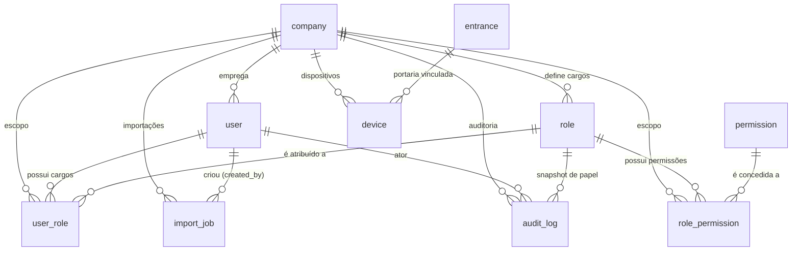

# Modelagem — Usuários, empresas e permissões

> Modelagem do banco para o **escopo de tenant, usuários e RBAC** do SOMAR, incluindo as tabelas de **suporte operacional** (`device`, `import_job`) e a **auditoria** (versão completa, planejada).
> Implementada pela migration `0001` (RBAC) e parcialmente pela `0005` (device/import), conforme [ADR 0001](../adr/0001-migrations-seeds-iniciais.md).
> Regras de negócio deste escopo: [regra-negocio-usuarios-empresas-permissoes.md](../produto/regra-negocio-usuarios-empresas-permissoes.md).

## Escopo

Tabelas do domínio de tenant, usuários e RBAC, mais o suporte operacional:

| Domínio lógico              | Tabelas                                                                | Migração                             |
| --------------------------- | ---------------------------------------------------------------------- | ------------------------------------ |
| Tenant e usuários           | `company`, `user`                                                      | `0001`                               |
| RBAC                        | `role`, `permission` (catálogo global), `role_permission`, `user_role` | `0001`                               |
| Suporte operacional         | `device` (app do porteiro/sync), `import_job` (importação)             | `0005`                               |
| Auditoria (versão completa) | `audit_log`                                                            | `0006` (planejada, não implementada) |

Tabelas de **controle de veículos e fluxo de acesso** (`vehicle_type`, `vehicle`, `department`, `vehicle_department`, `user_vehicle`, `vehicle_qr_code`, `entrance`, `vehicle_block`, `entry_denial`, `block_request`, `vehicle_access`, `vehicle_movement`, `occupancy_snapshot`, `access_request`) estão documentadas em [modelagem-controle-veiculos.md](./modelagem-controle-veiculos.md).

## Diagrama de entidades (visão geral)

> `company`, `user`, `role`, `permission` são referenciados por várias tabelas do escopo de [controle de veículos](./modelagem-controle-veiculos.md) via FK.

## Tenant e usuários (migração `0001`)

### `company` — empresas (tenant)

| Coluna                      | Tipo                                             | Constraints / Notas                                 |
| --------------------------- | ------------------------------------------------ | --------------------------------------------------- |
| `id`                        | uuid                                             | PK, default `gen_random_uuid()`                     |
| `name`                      | varchar(255) NOT NULL                            |                                                     |
| `is_active`                 | boolean NOT NULL DEFAULT true                    |                                                     |
| `timezone`                  | varchar(64) NOT NULL DEFAULT 'America/Sao_Paulo' | fuso usado nos cortes de dia (dashboard/relatórios) |
| `created_at` / `updated_at` | timestamptz NOT NULL DEFAULT now()               |                                                     |

> Seed: empresa padrão **SOMAR** (`timezone = 'America/Sao_Paulo'`) — ver [seeds](#dados-base-seedados).

### `user` — usuários

| Coluna                      | Tipo                                   | Constraints / Notas                                                                                                                                  |
| --------------------------- | -------------------------------------- | ---------------------------------------------------------------------------------------------------------------------------------------------------- |
| `id`                        | uuid                                   | PK, default `gen_random_uuid()`                                                                                                                      |
| `company_id`                | uuid NOT NULL                          | FK → `company(id)`                                                                                                                                   |
| `name`                      | varchar(255) NOT NULL                  |                                                                                                                                                      |
| `email`                     | varchar(255) NOT NULL                  | `UQ_user_company_id_email UNIQUE (company_id, email)` — mesmo email pode existir em empresas diferentes (base p/ identidade entre tenants no futuro) |
| `password`                  | varchar(255) NOT NULL                  | hash (bcrypt), nunca texto puro                                                                                                                      |
| `phone`                     | varchar(32) NULL                       |                                                                                                                                                      |
| `document`                  | varchar(32) NULL                       | `UQ_user_company_id_document UNIQUE (company_id, document)`                                                                                          |
| `type`                      | `user_type` NOT NULL DEFAULT 'VISITOR' | `EMPLOYEE` / `VISITOR`                                                                                                                               |
| `is_active`                 | boolean NOT NULL DEFAULT true          | desativado deixa de operar                                                                                                                           |
| `observation`               | text NULL                              |                                                                                                                                                      |
| `photo_url`                 | varchar(512) NULL                      |                                                                                                                                                      |
| `created_at` / `updated_at` | timestamptz NOT NULL DEFAULT now()     |                                                                                                                                                      |

Índices: `IDX_user_company_id (company_id)`.

## RBAC (migração `0001`)

### `role` — cargos (por empresa)

| Coluna                      | Tipo                               | Constraints / Notas                   |
| --------------------------- | ---------------------------------- | ------------------------------------- |
| `id`                        | uuid                               | PK, default `gen_random_uuid()`       |
| `company_id`                | uuid NOT NULL                      | FK → `company(id)`                    |
| `name`                      | varchar(100) NOT NULL              |                                       |
| `description`               | text NULL                          |                                       |
| `is_admin`                  | boolean NOT NULL DEFAULT false     | cargo de administração (acesso total) |
| `is_active`                 | boolean NOT NULL DEFAULT true      |                                       |
| `created_at` / `updated_at` | timestamptz NOT NULL DEFAULT now() |                                       |

### `permission` — catálogo global de permissões

> Tabela **global do sistema** (sem `company_id`). O vínculo com a empresa ocorre via `role_permission`.

| Coluna                      | Tipo                               | Constraints / Notas                |
| --------------------------- | ---------------------------------- | ---------------------------------- |
| `id`                        | uuid                               | PK, default `gen_random_uuid()`    |
| `code`                      | varchar(100) NOT NULL              | `UQ_permission_code UNIQUE (code)` |
| `description`               | text NULL                          |                                    |
| `created_at` / `updated_at` | timestamptz NOT NULL DEFAULT now() |                                    |

### `role_permission` — permissões de cada cargo

| Coluna                      | Tipo                               | Constraints / Notas                                                         |
| --------------------------- | ---------------------------------- | --------------------------------------------------------------------------- |
| `id`                        | uuid                               | PK, default `gen_random_uuid()`                                             |
| `company_id`                | uuid NOT NULL                      | FK → `company(id)` — tenant direto (consistente com as demais tabelas-join) |
| `role_id`                   | uuid NOT NULL                      | FK → `role(id)`                                                             |
| `permission_id`             | uuid NOT NULL                      | FK → `permission(id)`                                                       |
| `created_at` / `updated_at` | timestamptz NOT NULL DEFAULT now() |                                                                             |

Uniques: `UQ_role_permission_company_role_permission UNIQUE (company_id, role_id, permission_id)` — evita permissão repetida no cargo.

### `user_role` — cargos de cada usuário

| Coluna                      | Tipo                               | Constraints / Notas             |
| --------------------------- | ---------------------------------- | ------------------------------- |
| `id`                        | uuid                               | PK, default `gen_random_uuid()` |
| `company_id`                | uuid NOT NULL                      | FK → `company(id)`              |
| `user_id`                   | uuid NOT NULL                      | FK → `user(id)`                 |
| `role_id`                   | uuid NOT NULL                      | FK → `role(id)`                 |
| `created_at` / `updated_at` | timestamptz NOT NULL DEFAULT now() |                                 |

Uniques: `UQ_user_role_company_user_role UNIQUE (company_id, user_id, role_id)` — evita cargo repetido no usuário.

## Suporte operacional (migração `0005`)

### `device` — dispositivos do app do porteiro (sync offline)

> Tablet **compartilhado** (sem dono). Mantém cache local + fila offline; usado no sync e na auditoria.

| Coluna                      | Tipo                               | Constraints / Notas                                                                                     |
| --------------------------- | ---------------------------------- | ------------------------------------------------------------------------------------------------------- |
| `id`                        | uuid                               | PK, default `gen_random_uuid()`                                                                         |
| `company_id`                | uuid NOT NULL                      | FK → `company(id)`                                                                                      |
| `name`                      | varchar(100) NOT NULL              | identificação amigável (ex.: "Tablet Portaria 1")                                                       |
| `token`                     | varchar(64) NOT NULL               | `UQ_device_company_token UNIQUE (company_id, token)` — identificador p/ sync                            |
| `platform`                  | `device_platform` NOT NULL         | `ANDROID` / `IOS`                                                                                       |
| `app_version`               | varchar(32) NULL                   |                                                                                                         |
| `entrance_id`               | uuid NULL                          | FK → `entrance(id)` — portaria vinculada ao tablet (preenche `entrance_id` dos eventos automaticamente) |
| `last_sync_at`              | timestamptz NULL                   | usado no pull incremental                                                                               |
| `is_active`                 | boolean NOT NULL DEFAULT true      | desativado → limpa cache do app                                                                         |
| `created_at` / `updated_at` | timestamptz NOT NULL DEFAULT now() |                                                                                                         |

### `import_job` — jobs de importação de planilhas

| Coluna                      | Tipo                                           | Constraints / Notas                                  |
| --------------------------- | ---------------------------------------------- | ---------------------------------------------------- |
| `id`                        | uuid                                           | PK, default `gen_random_uuid()`                      |
| `company_id`                | uuid NOT NULL                                  | FK → `company(id)`                                   |
| `type`                      | `import_job_type` NOT NULL                     | `VEHICLE` / `USER` / `USER_VEHICLE`                  |
| `status`                    | `import_job_status` NOT NULL DEFAULT 'PENDING' | `PENDING`, `PROCESSING`, `DONE`, `FAILED`, `PARTIAL` |
| `file_url`                  | varchar(512) NULL                              |                                                      |
| `created_by`                | uuid NULL                                      | FK → `user(id)`                                      |
| `errors`                    | jsonb NOT NULL DEFAULT '[]'                    | `[{row, message}]`                                   |
| `total_rows`                | integer NOT NULL DEFAULT 0                     |                                                      |
| `processed_rows`            | integer NOT NULL DEFAULT 0                     |                                                      |
| `created_at` / `updated_at` | timestamptz NOT NULL DEFAULT now()             |                                                      |

> Pós-importação: a **web** gera os QR codes dos veículos importados (em lote) e disponibiliza a impressão.

## Auditoria — versão completa (migração `0006`, planejada)

> **Não implementada nesta leva** (adiada sem impacto nas anteriores). Enum `audit_actor_type` (`USER`, `SYSTEM`, `API`) planejado.

| Coluna          | Tipo                               | Constraints / Notas                                                            |
| --------------- | ---------------------------------- | ------------------------------------------------------------------------------ |
| `id`            | uuid                               | PK, default `gen_random_uuid()`                                                |
| `company_id`    | uuid NULL                          | FK → `company(id)` — ações globais/sistema podem não ter tenant                |
| `actor_user_id` | uuid NULL                          | FK → `user(id)`                                                                |
| `actor_role_id` | uuid NULL                          | FK → `role(id)` — snapshot do papel (papel muda depois)                        |
| `actor_type`    | `audit_actor_type` NOT NULL        | `USER` / `SYSTEM` / `API`                                                      |
| `action`        | varchar(64) NOT NULL               | `CREATE`, `UPDATE`, `DELETE`, `LOGIN`, `EXPORT`, `IMPORT`, `PRINT_QRCODE`, ... |
| `entity_type`   | varchar(64) NOT NULL               | `'vehicle'`, `'user'`, `'role'`, `'vehicle_access'`, ...                       |
| `entity_id`     | uuid NULL                          |                                                                                |
| `request_id`    | uuid NULL                          | correlaciona todas as mudanças de 1 requisição                                 |
| `context`       | jsonb NOT NULL DEFAULT '{}'        | `{ ip, user_agent, device_id, app_version }`                                   |
| `old_values`    | jsonb NULL                         | snapshot antes                                                                 |
| `new_values`    | jsonb NULL                         | snapshot depois                                                                |
| `created_at`    | timestamptz NOT NULL DEFAULT now() | imutável (só INSERT, sem `updated_at`)                                         |

## Enums (nativos do PostgreSQL)

| Enum                | Valores                                              | Migração |
| ------------------- | ---------------------------------------------------- | -------- |
| `user_type`         | `EMPLOYEE`, `VISITOR`                                | `0001`   |
| `device_platform`   | `ANDROID`, `IOS`                                     | `0005`   |
| `import_job_type`   | `VEHICLE`, `USER`, `USER_VEHICLE`                    | `0005`   |
| `import_job_status` | `PENDING`, `PROCESSING`, `DONE`, `FAILED`, `PARTIAL` | `0005`   |
| `audit_actor_type`  | `USER`, `SYSTEM`, `API` (planejado)                  | `0006`   |

> Enums do escopo de veículos (`vehicle_block_type`, `vehicle_block_status`, `entry_denial_reason`, `sync_status`, `block_request_status`, `movement_type`, `movement_source`, `access_status`, `access_request_type`, `access_request_status`, `contact_channel`) — ver [modelagem-controle-veiculos.md](./modelagem-controle-veiculos.md).

## Regras de integridade notáveis

- **Multi-tenant**: toda tabela tem `company_id` (exceto `permission`, catálogo global, e `audit_log`, que pode ter `company_id` NULL). Toda referência deve pertencer ao **mesmo** `company_id` da linha (garantia em nível de aplicação — não expressável em SQL puro).
- **Catálogo global**: `permission` não tem `company_id`; o escopo por empresa ocorre via `role_permission` (que carrega `company_id` direto, consistente com as demais tabelas-join).
- **Uniques compostos por empresa**: `user` (email, document), `device` (token) — permitem o mesmo valor em empresas diferentes.
- **Extensão `pgcrypto`**: criada na `0001` (mantida no `down()`) para `gen_random_uuid()` em todo o schema.

## Dados base seedados

Seeds em `src/shared/database/typeorm/seeds/` (DML idempotente — ver [ADR 0001](../adr/0001-migrations-seeds-iniciais.md)):

- **`0001-seed-initial-permissions`** — catálogo global de **23 permissões** (`ON CONFLICT ("code") DO NOTHING`):
  `MANAGE_COMPANY`, `MANAGE_USERS`, `MANAGE_ROLES`, `MANAGE_VEHICLES`, `MANAGE_VEHICLE_TYPES`, `MANAGE_DEPARTMENTS`, `MANAGE_ENTRANCES`, `MANAGE_BLOCKS`, `MANAGE_ACCESS_REQUESTS`, `MANAGE_BLOCK_REQUESTS`, `MANAGE_IMPORTS`, `MANAGE_DEVICES`, `GRANT_FREE_PASS`, `PRINT_QRCODE`, `VIEW_DASHBOARDS`, `REGISTER_ENTRY`, `REGISTER_EXIT`, `REGISTER_DENIAL`, `CREATE_ACCESS_REQUEST`, `CANCEL_ACCESS_REQUEST`, `CREATE_BLOCK_REQUEST`, `MANUAL_CLOSE_ACCESS`, `INITIAL_ENTRY`.
- **`0002-seed-default-company-roles-admin-vehicle-types`** — dados base da empresa padrão **SOMAR** (IDs fixos para idempotência):
  - Empresa SOMAR (`timezone = 'America/Sao_Paulo'`);
  - Cargos: **Administração** (`is_admin = true`), **Segurança**, **Presidência**, **Porteiro**;
  - Mapeamento inicial `role_permission` (ajustável pela administração — decisão de "não engessar"):
    - `PORTEIRO`: `REGISTER_ENTRY`, `REGISTER_EXIT`, `REGISTER_DENIAL`, `CREATE_ACCESS_REQUEST`, `CANCEL_ACCESS_REQUEST`, `CREATE_BLOCK_REQUEST`, `VIEW_DASHBOARDS`;
    - `SEGURANÇA`: tudo do porteiro + `MANAGE_BLOCKS`;
    - `PRESIDÊNCIA`: `VIEW_DASHBOARDS`, `GRANT_FREE_PASS`, `MANAGE_BLOCKS`;
    - `ADMINISTRAÇÃO`: todas as 23 permissões (via `is_admin = true` e `role_permission` completa);
  - Usuário **admin** (e-mail/senha via `ADMIN_DEFAULT_EMAIL`/`ADMIN_DEFAULT_PASSWORD`, fallback dev; hash **bcrypt**; `type = EMPLOYEE`) + vínculo `user_role` Administração;
  - Tipos de veículo padrão: `FROTA` (`is_fleet = true`) e `PARTICULAR` (`is_fleet = false`).
- **Departamentos e vagas NÃO são seedados** — cadastro pela administração (obrigatório no início; a portaria só opera após esse cadastro).

## Referências

- [ADR 0001 — Migrations e seeds iniciais](../adr/0001-migrations-seeds-iniciais.md)
- [Regras de negócio — Usuários, empresas e permissões](../produto/regra-negocio-usuarios-empresas-permissoes.md)
- [Modelagem — Controle de veículos](./modelagem-controle-veiculos.md)
- Migrations: `src/shared/database/typeorm/migrations/0001-create-initial-multi-tenant-rbac-schema.ts`, `0005-create-request-device-import-schema.ts`
- Seeds: `src/shared/database/typeorm/seeds/0001-seed-initial-permissions.ts`, `0002-seed-default-company-roles-admin-vehicle-types.ts`
- Planejamento original do schema: `planejamento/planejamento-backend/planejamento-back-end.md`
