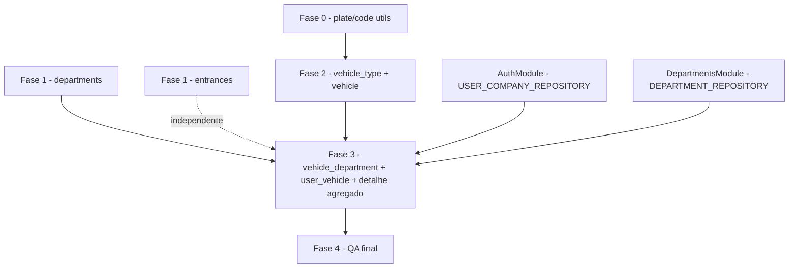

# Planejamento em Fases — Cadastros base (departamentos, portarias, tipos de veículo, veículos e vínculos)

> Planejamento de implementação da **Fase 2 do plano mestre** (`planejamento-cruds-rbac-cadastros.md`, "Fase 2 — Cadastros base") no backend: CRUD de `department`, `entrance`, `vehicle_type`, `vehicle` e os vínculos `vehicle_department` (departamento padrão) e `user_vehicle` (motoristas).
> Branch: `feature/cruds-de-rbac-e-cadastros-base-backend`.
> Contrato: [ADR 0006 — Cadastros base](../adr/0006-sistema-de-cadastros-base.md) e [regras-negocio-cadastros-base.md](../produto/regras-negocio-cadastros-base.md).
> Modelo de dados: [modelagem-controle-veiculos.md](./modelagem-controle-veiculos.md) (migrations `0002`/`0003` — **sem migrations novas**).

---

## 1. Contexto e objetivo

A Fase 1 do plano mestre (RBAC: roles + users) está **implementada e commitada**. Esta Fase 2 entrega a **API de administração dos cadastros base** que destrava as telas web de **tipos, veículos, departamentos e portarias** (cronograma intensivo — Semana 2).

**Escopo** (ADR 0006):

- CRUD de `department` (`MANAGE_DEPARTMENTS`), `entrance` (`MANAGE_ENTRANCES`), `vehicle_type` (`MANAGE_VEHICLE_TYPES`), `vehicle` (`MANAGE_VEHICLES`);
- Vínculos: `vehicle_department` (1 por veículo, upsert) e `user_vehicle` (1 primário por veículo) — sob `MANAGE_VEHICLES`;
- Regras-chave: desativação em vez de delete físico (exceto `user_vehicle`), placa normalizada + validada, `is_blocked` derivado (read-only), `free_pass` com `GRANT_FREE_PASS`, cross-tenant → 404, unicidade → 409.

**Fora do escopo** (semana 3+): QR code, bloqueios/`entry_denial`/`block_request`, `access_request` e fluxo de portaria (ADR 0006 §13).

## 2. Estratégia

- **Fatias testáveis** (regra de ouro do intensivo): cada fase fecha com testes unit + integração verdes. Ordem de menor para maior dependência: utils → CRUDs independentes → veículos (com dependências) → vínculos (join tables por último).
- **Reuso integral dos padrões da feature `users`** (já validada): estrutura em camadas, Symbol tokens, `toDomain()`, use cases com `execute(actor, dto)`, guards, `@RequirePermissions(PermissionCode.X)`, Swagger em `decorators/`, listagens `{ limit, offset, data, count, parameters? }`.
- **Toda feature importa `AuthModule`** (padrão de `users`/`roles` — os guards em `src/shared/guards/` injetam `ResolveAuthenticatedUserUseCase`/`ValidateJwtPayloadUseCase` do AuthModule).
- **Sem migrations nem seeds novos**: o schema `0002`/`0003` e os seeds de `vehicle_type` (`FROTA`/`PARTICULAR`) e permissões já cobrem o escopo — verificar no QA (Fase 4).

### Grafo de dependências (implementação)

- `DepartmentsModule` e `EntrancesModule`: só `AuthModule`.
- `VehiclesModule`: `AuthModule` (actor/guards) + `DepartmentsModule` (validação de `department` no vínculo e `parameters` da listagem — **sem ciclo**: departments não importa vehicles).

## 3. Fase 0 — Fundação compartilhada (utils)

> Objetivo: utilitários puros e testados usados pelas fases 2 e 3. Sem infraestrutura.

**Entregas**

- `src/shared/utils/plate.util.ts` — `normalizePlate(value)` (`trim` + `uppercase` + remove hífen/espaços) e `isValidBrazilianPlate(value)` (após normalização: `^[A-Z]{3}[0-9]{4}$` antiga **ou** `^[A-Z]{3}[0-9][A-Z][0-9]{2}$` Mercosul). JSDoc completo.
- `src/shared/utils/plate.util.spec.ts` — normalização (caixa/hífen/espaço), formatos válidos/inválidos.
- `src/shared/utils/code.util.ts` — `normalizeCode(value)` (`trim` + `uppercase`) para `vehicle_type.code` + spec.
- Verificação (sem edição): seeds `0002` já têm `FROTA`/`PARTICULAR`; nenhuma migration nova necessária.

**Marco testável**: `npm run test:unit -- --testPathPatterns="shared"` verde; typecheck/lint.

## 4. Fase 1 — Departamentos e portarias (CRUDs independentes)

> Objetivo: CRUD completo de `department` e `entrance` — entidades simples, sem dependências entre si (podem ser implementadas **em paralelo**). Destrava as telas de departamentos e portarias.

### 4.1 Feature `src/features/departments/` (`MANAGE_DEPARTMENTS`)

- `domain/entities/department.entity.ts`; `domain/repositories/department.repository.ts` (`export const DEPARTMENT_REPOSITORY = Symbol('DEPARTMENT_REPOSITORY')` — `create`, `findByIdAndCompanyId`, `listByCompanyId`, `updateByIdAndCompanyId`).
- `infrastructure/persistence/typeorm/department.orm-entity.ts` + `departments-typeorm.repository.ts` (com `toDomain()` privado); `infrastructure/persistence/providers/departments.providers.ts` (`{ provide: DEPARTMENT_REPOSITORY, useExisting: DepartmentsTypeormRepository }`).
- `application/dto/`: `create-department-input.dto.ts` (**`parking_space` obrigatório e `>= 0`**), `update-department-input.dto.ts` (parcial), `list-departments-input.dto.ts`, `get-department-input.dto.ts`, `department-response.ts` (com `parameters?` na listagem).
- `application/use-cases/`: `create-department` (400 sem vagas), `list-departments` (filtros `search`/`isActive` + `buildListParameters`), `get-department` (404), `update-department` (parcial; `parking_space` com 400), `deactivate-department` (soft, 204).
- `presentation/http/controllers/departments.controller.ts` (`@Controller('departments')`, `POST`/`GET`/`GET :id`/`PATCH :id`/`DELETE :id`) + DTOs de apresentação (`create-department.dto.ts`, `update-department.dto.ts`, `list-departments.query.dto.ts`).
- `decorators/api-departments.decorator.ts` (5 decorators).
- `departments.module.ts` (importa `AuthModule`; providers = 5 use cases + providers; controller; exporta `DEPARTMENT_REPOSITORY`).
- Testes: `tests/unit/` (5 specs — create com `parking_space` ausente → 400; list/get/update/deactivate; 404 cross-tenant); `tests/integration/departments.integration.spec.ts` (CRUD, 401/403, desativação/reativação, cross-tenant 404).

### 4.2 Feature `src/features/entrances/` (`MANAGE_ENTRANCES`)

- Espelho exato da 4.1, **sem** `parking_space`: `entrance.entity.ts`, `ENTRANCE_REPOSITORY`, orm/repo/providers, DTOs (create/update/list/get/response), 5 use cases, `entrances.controller.ts`, `api-entrances.decorator.ts`, `entrances.module.ts`.
- Testes: unit (5 specs) + `entrances.integration.spec.ts`.

### 4.3 Registro e validação

- Registrar `DepartmentsModule` e `EntrancesModule` em `src/app.module.ts`.
- **Marco testável**: `npm run test:unit -- --testPathPatterns="departments|entrances"` e `npm run test:integration -- departments|entrances` verdes; typecheck/lint.

## 5. Fase 2 — Tipos de veículo e veículos (CRUD) _(depende da Fase 0)_

> Objetivo: criar a feature `src/features/vehicles/` com o CRUD de `vehicle_type` e `vehicle` — as regras de placa, `free_pass`, `is_blocked` e tipo ativo. Destrava as telas de tipos e veículos.

### 5.1 `vehicle_type` (`MANAGE_VEHICLE_TYPES`)

- `domain/entities/vehicle-type.entity.ts`; `VEHICLE_TYPE_REPOSITORY` (`create`, `findByIdAndCompanyId`, `listByCompanyId`, `updateByIdAndCompanyId`).
- orm `vehicle-type.orm-entity.ts` + `vehicle-types-typeorm.repository.ts` + providers.
- DTOs: `create-vehicle-type-input.dto.ts` (**`code` normalizado via `normalizeCode`**; `is_fleet` default false), `update-...`, `list-vehicle-types-input.dto.ts` (filtros `search`/`isFleet`/`isActive`), `vehicle-type-response.ts`.
- Use cases: `create-vehicle-type` (409 unique), `list-vehicle-types` (com `parameters` p/ `isFleet`), `get-vehicle-type` (404), `update-vehicle-type` (409), `deactivate-vehicle-type` (soft).
- `vehicle-types.controller.ts` (`@Controller('vehicle-types')`) + DTOs apresentação + `api-vehicles.decorator.ts` (decorators de type + vehicle no mesmo arquivo do módulo).

### 5.2 `vehicle` (`MANAGE_VEHICLES`)

- `domain/entities/vehicle.entity.ts`; `VEHICLE_REPOSITORY` (`create`, `findByIdAndCompanyId`, `listByCompanyId` com filtros/join de tipo, `updateByIdAndCompanyId`).
- orm `vehicle.orm-entity.ts` + `vehicles-typeorm.repository.ts` + providers.
- DTOs: `create-vehicle-input.dto.ts` (`plate` **obrigatória**, `vehicle_type_id` **obrigatório**, `model`/`color`/`observation` opcionais, `free_pass` default false), `update-vehicle-input.dto.ts` (parcial — **rejeita `is_blocked`**), `list-vehicles-input.dto.ts` (`search`/`vehicleTypeId`/`freePass`/`isActive`), `get-vehicle-input.dto.ts`, `vehicle-response.ts` (`is_blocked` somente leitura; `parameters?`).
- Use cases: `create-vehicle` (placa normalizada+validada → 400 inválida; **`vehicle_type_id` ativo da sessão** → 404 inexistente/outro tenant, 400 inativo; **`free_pass=true` exige `GRANT_FREE_PASS`** → 403; **`is_blocked` no body → 400**; placa duplicada → 409), `list-vehicles` (busca por placa normalizada ou trecho de modelo; `parameters` com `allowed_values` dos **tipos ativos**), `get-vehicle` (404), `update-vehicle` (parcial, mesmas validações), `deactivate-vehicle` (soft — não fecha acessos/QR/bloqueios).
- `vehicles.controller.ts` (`@Controller('vehicles')`). **Nesta fase o detalhe ainda não é agregado** (vínculos só na Fase 3); `GET /vehicles/:id` devolve veículo + `vehicle_type`.
- `vehicles.module.ts` (importa `AuthModule`; providers; controllers `[VehicleTypesController, VehiclesController]`; exporta `VEHICLE_REPOSITORY`, `VEHICLE_TYPE_REPOSITORY`).
- Testes: unit (10 specs) + `vehicle-types.integration.spec.ts` e `vehicles.integration.spec.ts` (CRUD, placa 400/409, `free_pass` 403, `is_blocked` 400, tipo inativo 400, cross-tenant 404, 401/403).

**Marco testável**: CRUD de tipo e veículo verdes em unit + integração; typecheck/lint.

## 6. Fase 3 — Vínculos e detalhe agregado _(depende das Fases 1 e 2)_

> Objetivo: endpoints de `vehicle_department` (1 por veículo, upsert) e `user_vehicle` (1 primário por veículo), e o detalhe agregado do veículo. Fecha o contrato do ADR 0006 §§8–11.

### 6.1 `vehicle_department` (`/vehicles/:id/department`, `MANAGE_VEHICLES`)

- `domain/entities/vehicle-department.entity.ts`; `VEHICLE_DEPARTMENT_REPOSITORY` (`upsertByVehicleIdAndCompanyId` — cria ou reativa/atualiza a linha única; `findActiveByVehicleIdAndCompanyId`; `deactivateByVehicleIdAndCompanyId`).
- orm `vehicle-department.orm-entity.ts` + repo + providers.
- Use cases: `set-vehicle-department` (`PUT` — valida `department` **ativo** da sessão via `DEPARTMENT_REPOSITORY` → 404/400; upsert), `get-vehicle-department` (`GET` — vínculo ativo ou 404), `remove-vehicle-department` (`DELETE` — `is_active = false`, 204).
- `vehicle-department.controller.ts` + DTOs (`set-vehicle-department-input.dto.ts`, apresentação) + decorators.

### 6.2 `user_vehicle` (`/vehicles/:id/drivers`, `MANAGE_VEHICLES`)

- `domain/entities/user-vehicle.entity.ts` (com `UserVehicleWithUserEntity`); `USER_VEHICLE_REPOSITORY` (`create` com transação para desmarcar primário anterior, `findByVehicleIdAndCompanyId`, `findByUserIdAndVehicleIdAndCompanyId`, `updateByIdAndCompanyId`, `removeByIdAndCompanyId`).
- orm `user-vehicle.orm-entity.ts` + repo + providers.
- Use cases: `assign-driver-to-vehicle` (`POST` — veículo da sessão 404; **usuário com `user_company` ativo** via `USER_COMPANY_REPOSITORY` → 404; vínculo duplicado → 409; `is_primary=true` **desmarca o primário anterior** na mesma transação; `is_primary`/`can_drive` default), `list-vehicle-drivers` (`GET` — vínculos com nome do usuário), `update-vehicle-driver` (`PATCH /:userId` — `is_primary`/`can_drive` sem remover+recriar; `is_primary=true` desmarca os demais), `remove-vehicle-driver` (`DELETE /:userId` — **físico**, 204).
- `vehicle-drivers.controller.ts` + DTOs (`assign-driver-input.dto.ts`, `update-driver-input.dto.ts`) + decorators.

### 6.3 Detalhe agregado e filtro de departamento

- `get-vehicle` passa a agregar: `vehicle_type` + **departamento padrão ativo** (`{ id, name }` ou `null` via `VEHICLE_DEPARTMENT_REPOSITORY` + `DEPARTMENT_REPOSITORY`) + **motoristas** (`[{ user_id, name, is_primary, can_drive }]` via `USER_VEHICLE_REPOSITORY` + `USER_REPOSITORY`) + `is_blocked`.
- `list-vehicles` ganha filtro `departmentId` (via `vehicle_department`) e `parameters` com `allowed_values` dos **departamentos ativos** (`VehiclesModule` passa a importar `DepartmentsModule`).

**Marco testável**: unit (7 specs) + `vehicles-links.integration.spec.ts` (upsert substituindo linha inativa, `DELETE` desativa, primário substitui, duplicidade 409, usuário sem vínculo ativo 404, `PATCH can_drive`, delete físico, cross-tenant 404, detalhe agregado).

## 7. Fase 4 — Integração e QA final _(depende das fases 1–3)_

> Objetivo: fechar a fase com contratos estáveis e validação multi-tenant ponta a ponda.

1. Rodar suíte completa da branch: `npm run typecheck`, `npm run lint`, `npm run build`.
2. `npm run test:unit -- --testPathPatterns="users|roles|auth|shared|departments|entrances|vehicles"`.
3. `npm run test:integration` (full, Docker ligado) — todas as features.
4. Conferir Swagger (backend :3100/api): rotas de `/vehicle-types`, `/vehicles`, `/vehicles/:id/department`, `/vehicles/:id/drivers`, `/departments`, `/entrances`; schemas e formatos de listagem `{ limit, offset, data, count, parameters? }` consistentes com o cliente web (Fase 3 do plano mestre).
5. Revisar seeds/migrations: confirmar que `0002`/`0003` + seeds cobrem o escopo (**nenhuma migration nova**).
6. Preparar commit/issue (issue no repositório de issues, pasta `<YYYY-MM-DD>/` — convenção AGENTS.md §8).

## 8. Padrões técnicos (reuso da feature `users`)

- **Estrutura**: `application/` (dto, use-cases, utils) · `domain/` (entities, repositories com Symbol) · `infrastructure/persistence/typeorm/` + `providers/` · `presentation/http/` (controllers, dto) · `decorators/api-<feature>.decorator.ts` · `tests/` · `<feature>.module.ts`.
- **Autorização**: `@UseGuards(JwtAuthGuard, PermissionsGuard)` no nível da classe + `@RequirePermissions(PermissionCode.X)` — nunca string hardcoded. `is_admin` faz bypass (ADR 0004 §2).
- **Multi-tenant**: métodos com sufixo `AndCompanyId`; referência de outro tenant → **404** (ADR 0006 §1). Para `user` em `user_vehicle`, validação pelo vínculo ativo `user_company` (nunca `user.company_id`).
- **Transações**: `dataSource.transaction()` nos repositórios para `user_vehicle` (desmarcar primário + criar) — nunca em use case.
- **Unicidade → 409**: tradução de `QueryFailedError` (23505) com mensagem estável, como `create-user` (ADR 0005 §2).
- **DTOs**: apresentação com `class-validator`/`class-transformer` (incluindo `@Transform` para `normalizePlate`/`normalizeCode` antes das validações); aplicação puros, sem decorators.
- **Resposta**: nunca ORM cru; `toDomain()` privado nos repositórios; mappers em `application/utils/`; listagens no formato padrão com `ParameterDto` (`src/shared/dto/parameter.dto.ts`).
- **Logger + JSDoc**: `private readonly logger = new Logger(XUseCase.name)`; JSDoc completo em todo método público (AGENTS.md §3).
- **DI**: cada módulo importa `AuthModule`; `VehiclesModule` importa também `DepartmentsModule` (sem ciclo).

## 9. Riscos e mitigação

| Risco                                                    | Impacto                            | Mitigação                                                                                                           |
| -------------------------------------------------------- | ---------------------------------- | ------------------------------------------------------------------------------------------------------------------- |
| Tamanho da feature `vehicles` (4 entidades + 2 vínculos) | Fase estoura                       | Quebrar em Fase 2 (CRUD) e Fase 3 (vínculos) — cada uma fechada com testes                                          |
| `is_primary`/`vehicle_department` com unique parcial     | Regra quebrada por concorrência    | Substituição em transação + teste de duplicidade; 409 no unique parcial                                             |
| Placa inconsistente no catálogo                          | Busca na portaria com ruído        | `normalizePlate` + validação de formato na Fase 0, testada antes do CRUD                                            |
| `free_pass`/`is_blocked` mal tratados no CRUD            | Vazamento de regra para a portaria | 403 (`GRANT_FREE_PASS`) e 400 (`is_blocked`) cobertos por testes de integração                                      |
| Dependência `vehicles → departments`                     | Ciclo de DI                        | Departments não importa vehicles; `VehiclesModule` importa `DepartmentsModule` (padrão `UsersModule → RolesModule`) |
| Contrato divergente com a web                            | Retrabalho                         | Formatos de listagem/detalhe definidos no ADR 0006 §§11 e conferidos no Swagger (Fase 4)                            |

## 10. Referências

- [ADR 0006 — Cadastros base](../adr/0006-sistema-de-cadastros-base.md) — contrato (rotas, permissões, invariantes).
- [Regras de negócio — Cadastros base](../produto/regras-negocio-cadastros-base.md) — 35 regras.
- [Modelagem — Controle de veículos e fluxo de acesso](./modelagem-controle-veiculos.md) — schema `0002`/`0003`.
- [ADR 0005 — Sistema de usuários](../adr/0005-sistema-de-usuarios.md) — padrões reusados (404 cross-tenant, 409, DTOs, guards).
- Feature `src/features/users/` — template de estrutura, use cases, repositórios e testes.
- `planejamento-cruds-rbac-cadastros.md` — plano mestre (Fase 2, seção 4) e padrões técnicos (seção 6).
